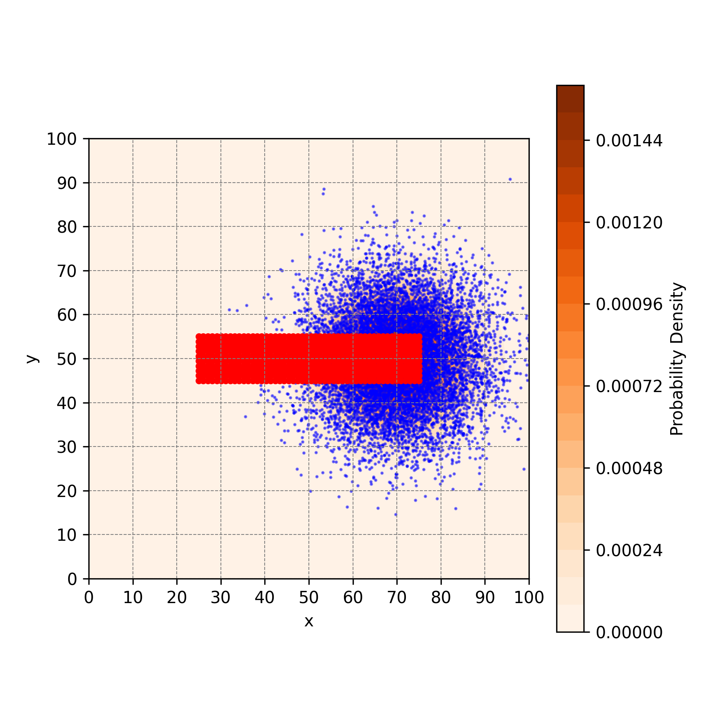
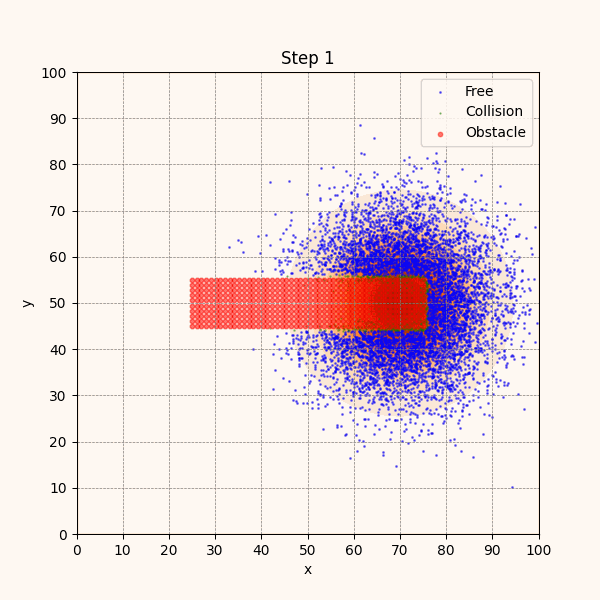
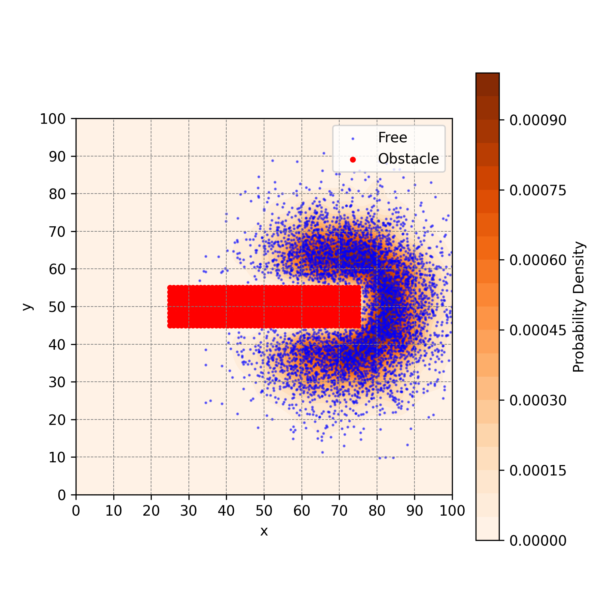
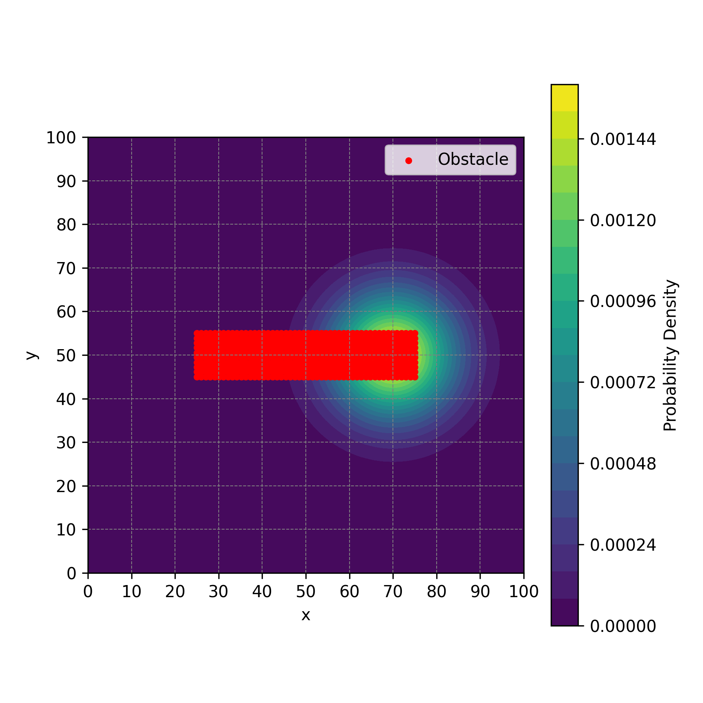
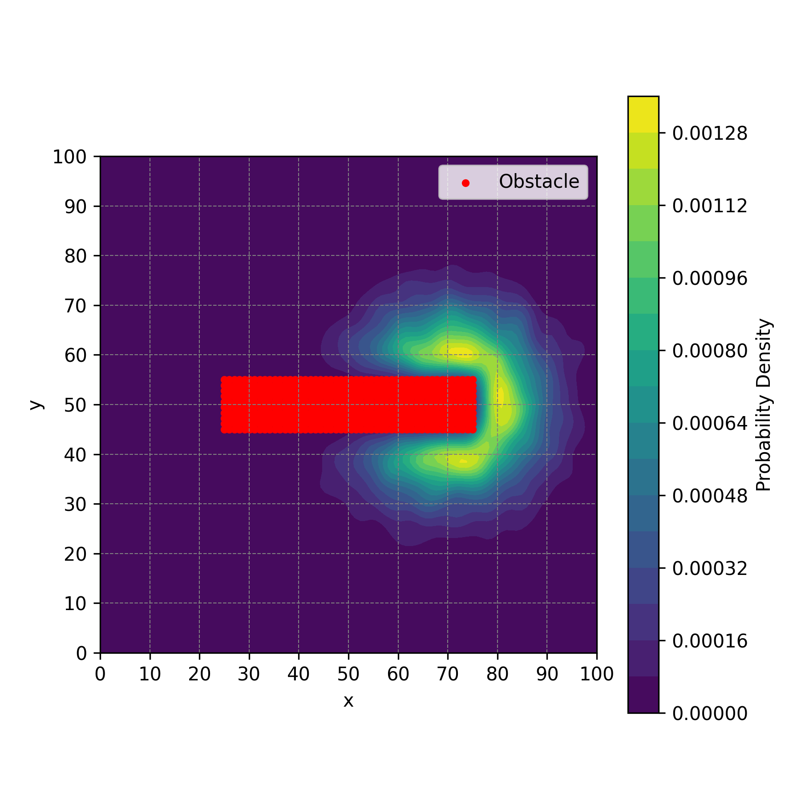

# Obstacle-Aware Diffusion


A lightweight Python simulation of probabilistic particle diffusion in environments with obstacles, inspired by Brownian motion and sampling-based methods. The approach estimates a modified probability density function (PDF) over a 2D space, accounting for non-traversable regions.

| Initial Simulation | Diffusion Process | Final Simulation |
|---------------------|---------------------|---------------------|
|  |  |  |
|  |  |  |

### Diffusion process

The diffusion process is based on a sampling-based approach, where particles are randomly sampled from an initial PDF guess (e.g., Gaussian) and diffused over time with Brownian motion. The diffusion process is influenced by the presence of obstacles in the environment, which are represented as non-traversable regions.

## ✨ Features

- Sampling-based diffusion of particles from an initial PDF guess (e.g., Gaussian)
- Obstacle-aware rejection using KD-Trees for fast collision checks
- KDE-based PDF estimation

## 📦 Dependencies

```bash
pip install numpy matplotlib scipy
